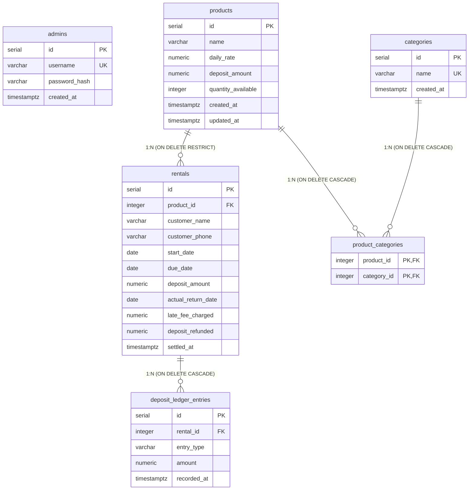

# Relational SQL Backend Schema Specification (PostgreSQL)

**Document Version:** 1.0  
**Target Database Engine:** PostgreSQL 15+  
**Author:** Senior Database Architect  
**Scope:** Relational tables, datatypes, constraints, indices, foreign key cascades, and migration scripts.  

---

## 1. Executive Database Summary

This document specifies the PostgreSQL relational schema designed to support the Rental Management System. 

### Core Database Rules:
1.  **Monetary Consistency**: All currency values (`daily_rate`, `deposit_amount`, `late_fee_charged`, `deposit_refunded`) must use the **`NUMERIC(10, 2)`** datatype. Floating-point types (`REAL`, `DOUBLE PRECISION`) are prohibited to avoid binary rounding issues.
2.  **Temporal Consistency**: System event times (`created_at`, `settled_at`) use **`TIMESTAMP WITH TIME ZONE`** (`timestamptz`) to remain timezone-agnostic. Operational business days (`start_date`, `due_date`, `actual_return_date`) use the **`DATE`** type.
3.  **Relational Integrity**: Mandatory `FOREIGN KEY` constraints with strict validation rules. Deletions of products linked to active rentals are blocked at the database engine level.
4.  **Value Boundaries**: Column check constraints (`CHECK`) enforce boundary validation rules directly on table insertions (e.g., quantities and monetary rates cannot fall below zero).

---

## 2. Entity-Relationship Diagram (ERD)

The following Mermaid diagram outlines the entity schemas, key constraints, and logical relations (including 1:N and N:M associations):



---

## 3. Table-by-Table Specifications

### 3.1 Table: `admins`
Stores credentials for the administrative panel.

| Column Name | Data Type | Constraints | Default | Description |
|---|---|---|---|---|
| `id` | `SERIAL` | `PRIMARY KEY` | Next Sequence | Unique serial identifier. |
| `username` | `VARCHAR(50)` | `UNIQUE`, `NOT NULL` | None | Login username. |
| `password_hash` | `VARCHAR(255)` | `NOT NULL` | None | Secure Argon2id password hash. |
| `created_at` | `TIMESTAMP WITH TIME ZONE`| `NOT NULL` | `CURRENT_TIMESTAMP` | Account creation timestamp. |

---

### 3.2 Table: `products`
The product inventory catalog.

| Column Name | Data Type | Constraints | Default | Description |
|---|---|---|---|---|
| `id` | `SERIAL` | `PRIMARY KEY` | Next Sequence | Unique serial identifier. |
| `name` | `VARCHAR(100)` | `NOT NULL` | None | Item name. Indexed. |
| `daily_rate` | `NUMERIC(10, 2)` | `NOT NULL`, `CHECK (daily_rate > 0.0)` | None | Rental cost per day. |
| `deposit_amount` | `NUMERIC(10, 2)` | `NOT NULL`, `CHECK (deposit_amount >= 0.0)`| None | Required deposit security sum. |
| `quantity_available` | `INTEGER` | `NOT NULL`, `CHECK (quantity_available >= 0)` | `0` | Physical stock count remaining. |
| `created_at` | `TIMESTAMP WITH TIME ZONE`| `NOT NULL` | `CURRENT_TIMESTAMP` | Catalog entry timestamp. |
| `updated_at` | `TIMESTAMP WITH TIME ZONE`| `NOT NULL` | `CURRENT_TIMESTAMP` | Last updated timestamp. |

---

### 3.3 Table: `rentals`
Core transactional table recording rentals, dates, and settlements.

| Column Name | Data Type | Constraints | Default | Description |
|---|---|---|---|---|
| `id` | `SERIAL` | `PRIMARY KEY` | Next Sequence | Unique serial identifier. |
| `product_id` | `INTEGER` | `NOT NULL`, `FOREIGN KEY` | None | Reference to `products.id`. `ON DELETE RESTRICT`. |
| `customer_name` | `VARCHAR(100)` | `NOT NULL` | None | Customer's full name. Indexed. |
| `customer_phone` | `VARCHAR(20)` | `NOT NULL` | None | Customer's phone number. Indexed. |
| `start_date` | `DATE` | `NOT NULL` | None | Commencement day. |
| `due_date` | `DATE` | `NOT NULL` | None | Required return day. Indexed. |
| `deposit_amount` | `NUMERIC(10, 2)` | `NOT NULL`, `CHECK (deposit_amount >= 0.0)`| None | Actual deposit cash captured. |
| `actual_return_date` | `DATE` | `NULL` | `NULL` | Day return was processed. |
| `late_fee_charged` | `NUMERIC(10, 2)` | `NULL`, `CHECK (late_fee_charged >= 0.0)`| `NULL` | Computed penalty applied. |
| `deposit_refunded` | `NUMERIC(10, 2)` | `NULL`, `CHECK (deposit_refunded >= 0.0)`| `NULL` | Cash returned to client. |
| `settled_at` | `TIMESTAMP WITH TIME ZONE`| `NULL` | `NULL` | Timestamp of operational settlement. |

#### Table Checks (Multi-column Constraints):
*   `CONSTRAINT chk_rental_dates`: Checks that `due_date >= start_date`.
*   `CONSTRAINT chk_return_date`: Checks that `actual_return_date IS NULL` or `actual_return_date >= start_date`.

---

### 3.4 Table: `deposit_ledger_entries`
1:N association tracking deposit transactions per rental. Satisfies audit ledger requirements.

| Column Name | Data Type | Constraints | Default | Description |
|---|---|---|---|---|
| `id` | `SERIAL` | `PRIMARY KEY` | Next Sequence | Unique serial identifier. |
| `rental_id` | `INTEGER` | `NOT NULL`, `FOREIGN KEY` | None | Reference to `rentals.id`. `ON DELETE CASCADE`. |
| `entry_type` | `VARCHAR(30)` | `NOT NULL`, `CHECK (type IN ('COLLECTED', 'DEDUCTION', 'REFUNDED'))` | None | Category of transaction. |
| `amount` | `NUMERIC(10, 2)` | `NOT NULL`, `CHECK (amount >= 0.0)` | None | Value of entry. |
| `recorded_at` | `TIMESTAMP WITH TIME ZONE`| `NOT NULL` | `CURRENT_TIMESTAMP` | Creation timestamp. |

---

### 3.5 Table: `categories` & `product_categories` (N:M Relationship)
Associates catalog products to multiple categories (Many-to-Many).

#### Table: `categories`
| Column Name | Data Type | Constraints | Default | Description |
|---|---|---|---|---|
| `id` | `SERIAL` | `PRIMARY KEY` | Next Sequence | Unique identifier. |
| `name` | `VARCHAR(50)` | `UNIQUE`, `NOT NULL` | None | Category name. |
| `created_at` | `TIMESTAMP WITH TIME ZONE`| `NOT NULL` | `CURRENT_TIMESTAMP` | Creation time. |

#### Table: `product_categories` (Junction Table)
| Column Name | Data Type | Constraints | Default | Description |
|---|---|---|---|---|
| `product_id` | `INTEGER` | `PRIMARY KEY`, `FOREIGN KEY` | None | Reference to `products.id`. `ON DELETE CASCADE`. |
| `category_id` | `INTEGER` | `PRIMARY KEY`, `FOREIGN KEY` | None | Reference to `categories.id`. `ON DELETE CASCADE`. |

---

## 4. DDL Scripts & Indexing (PostgreSQL Syntax)

The following scripts create the tables, relationships, constraints, and operational indexes.

```sql
-- DDL SETUP SCRIPT FOR POSTGRESQL 15+

-- 1. Admins Table
CREATE TABLE admins (
    id SERIAL PRIMARY KEY,
    username VARCHAR(50) UNIQUE NOT NULL,
    password_hash VARCHAR(255) NOT NULL,
    created_at TIMESTAMP WITH TIME ZONE NOT NULL DEFAULT CURRENT_TIMESTAMP
);

-- 2. Products Table
CREATE TABLE products (
    id SERIAL PRIMARY KEY,
    name VARCHAR(100) NOT NULL,
    daily_rate NUMERIC(10, 2) NOT NULL,
    deposit_amount NUMERIC(10, 2) NOT NULL,
    quantity_available INTEGER NOT NULL DEFAULT 0,
    created_at TIMESTAMP WITH TIME ZONE NOT NULL DEFAULT CURRENT_TIMESTAMP,
    updated_at TIMESTAMP WITH TIME ZONE NOT NULL DEFAULT CURRENT_TIMESTAMP,
    
    CONSTRAINT chk_daily_rate CHECK (daily_rate > 0.0),
    CONSTRAINT chk_deposit_amount CHECK (deposit_amount >= 0.0),
    CONSTRAINT chk_quantity CHECK (quantity_available >= 0)
);

-- 3. Rentals Table
CREATE TABLE rentals (
    id SERIAL PRIMARY KEY,
    product_id INTEGER NOT NULL,
    customer_name VARCHAR(100) NOT NULL,
    customer_phone VARCHAR(20) NOT NULL,
    start_date DATE NOT NULL,
    due_date DATE NOT NULL,
    deposit_amount NUMERIC(10, 2) NOT NULL,
    actual_return_date DATE,
    late_fee_charged NUMERIC(10, 2),
    deposit_refunded NUMERIC(10, 2),
    settled_at TIMESTAMP WITH TIME ZONE,
    
    CONSTRAINT fk_rentals_product FOREIGN KEY (product_id) 
        REFERENCES products (id) ON DELETE RESTRICT,
        
    CONSTRAINT chk_deposit_amount CHECK (deposit_amount >= 0.0),
    CONSTRAINT chk_late_fee CHECK (late_fee_charged >= 0.0),
    CONSTRAINT chk_deposit_refund CHECK (deposit_refunded >= 0.0),
    CONSTRAINT chk_rental_dates CHECK (due_date >= start_date),
    CONSTRAINT chk_return_date CHECK (actual_return_date IS NULL OR actual_return_date >= start_date)
);

-- 4. Deposit Ledger Table (1:N)
CREATE TABLE deposit_ledger_entries (
    id SERIAL PRIMARY KEY,
    rental_id INTEGER NOT NULL,
    entry_type VARCHAR(30) NOT NULL,
    amount NUMERIC(10, 2) NOT NULL,
    recorded_at TIMESTAMP WITH TIME ZONE NOT NULL DEFAULT CURRENT_TIMESTAMP,
    
    CONSTRAINT fk_ledger_rental FOREIGN KEY (rental_id) 
        REFERENCES rentals (id) ON DELETE CASCADE,
        
    CONSTRAINT chk_ledger_amount CHECK (amount >= 0.0),
    CONSTRAINT chk_ledger_type CHECK (entry_type IN ('COLLECTED', 'DEDUCTION', 'REFUNDED'))
);

-- 5. Categories Table (N:M Support)
CREATE TABLE categories (
    id SERIAL PRIMARY KEY,
    name VARCHAR(50) UNIQUE NOT NULL,
    created_at TIMESTAMP WITH TIME ZONE NOT NULL DEFAULT CURRENT_TIMESTAMP
);

-- 6. Product-Categories Junction Table
CREATE TABLE product_categories (
    product_id INTEGER NOT NULL,
    category_id INTEGER NOT NULL,
    
    PRIMARY KEY (product_id, category_id),
    
    CONSTRAINT fk_pc_product FOREIGN KEY (product_id) 
        REFERENCES products (id) ON DELETE CASCADE,
        
    CONSTRAINT fk_pc_category FOREIGN KEY (category_id) 
        REFERENCES categories (id) ON DELETE CASCADE
);

-- INDEXES FOR OPERATIONAL PERFORMANCE

-- Optimize dashboard queries checking active vs overdue status
CREATE INDEX idx_rentals_active_overdue 
ON rentals (due_date, actual_return_date) 
WHERE actual_return_date IS NULL;

-- Optimize searching for customer operations
CREATE INDEX idx_rentals_customer_search 
ON rentals (customer_phone, customer_name);

-- Optimize product foreign key relationships lookups
CREATE INDEX idx_rentals_product_id ON rentals (product_id);

-- Optimize full text or sorting search on product name
CREATE INDEX idx_products_name ON products (name);
```

---

## 5. Schema Migration Plan (SQL & Alembic)

Migrating database structures safely is handled via sequential migration histories.

### 5.1 Migration V1: Core Tables (SQL Migration Scripts)
Initial schema deployment creating Core structures.

```sql
-- migration_v1.sql
BEGIN;

CREATE TABLE admins (
    id SERIAL PRIMARY KEY,
    username VARCHAR(50) UNIQUE NOT NULL,
    password_hash VARCHAR(255) NOT NULL,
    created_at TIMESTAMP WITH TIME ZONE NOT NULL DEFAULT CURRENT_TIMESTAMP
);

CREATE TABLE products (
    id SERIAL PRIMARY KEY,
    name VARCHAR(100) NOT NULL,
    daily_rate NUMERIC(10, 2) NOT NULL CHECK (daily_rate > 0.0),
    deposit_amount NUMERIC(10, 2) NOT NULL CHECK (deposit_amount >= 0.0),
    quantity_available INTEGER NOT NULL DEFAULT 0 CHECK (quantity_available >= 0),
    created_at TIMESTAMP WITH TIME ZONE NOT NULL DEFAULT CURRENT_TIMESTAMP,
    updated_at TIMESTAMP WITH TIME ZONE NOT NULL DEFAULT CURRENT_TIMESTAMP
);

CREATE TABLE rentals (
    id SERIAL PRIMARY KEY,
    product_id INTEGER NOT NULL REFERENCES products(id) ON DELETE RESTRICT,
    customer_name VARCHAR(100) NOT NULL,
    customer_phone VARCHAR(20) NOT NULL,
    start_date DATE NOT NULL,
    due_date DATE NOT NULL CHECK (due_date >= start_date),
    deposit_amount NUMERIC(10, 2) NOT NULL CHECK (deposit_amount >= 0.0),
    actual_return_date DATE CHECK (actual_return_date IS NULL OR actual_return_date >= start_date),
    late_fee_charged NUMERIC(10, 2) CHECK (late_fee_charged >= 0.0),
    deposit_refunded NUMERIC(10, 2) CHECK (deposit_refunded >= 0.0),
    settled_at TIMESTAMP WITH TIME ZONE
);

CREATE TABLE deposit_ledger_entries (
    id SERIAL PRIMARY KEY,
    rental_id INTEGER NOT NULL REFERENCES rentals(id) ON DELETE CASCADE,
    entry_type VARCHAR(30) NOT NULL CHECK (entry_type IN ('COLLECTED', 'DEDUCTION', 'REFUNDED')),
    amount NUMERIC(10, 2) NOT NULL CHECK (amount >= 0.0),
    recorded_at TIMESTAMP WITH TIME ZONE NOT NULL DEFAULT CURRENT_TIMESTAMP
);

CREATE INDEX idx_rentals_active_overdue ON rentals (due_date, actual_return_date) WHERE actual_return_date IS NULL;
CREATE INDEX idx_rentals_customer_search ON rentals (customer_phone, customer_name);

COMMIT;
```

### 5.2 Migration V2: N:M Category Extensions (SQL Migration Scripts)
Applies database schema updates safely without altering transactional tables.

```sql
-- migration_v2.sql
BEGIN;

CREATE TABLE categories (
    id SERIAL PRIMARY KEY,
    name VARCHAR(50) UNIQUE NOT NULL,
    created_at TIMESTAMP WITH TIME ZONE NOT NULL DEFAULT CURRENT_TIMESTAMP
);

CREATE TABLE product_categories (
    product_id INTEGER NOT NULL REFERENCES products(id) ON DELETE CASCADE,
    category_id INTEGER NOT NULL REFERENCES categories(id) ON DELETE CASCADE,
    PRIMARY KEY (product_id, category_id)
);

CREATE INDEX idx_product_categories_category ON product_categories (category_id);

COMMIT;
```

---

### 5.3 Python Alembic Migration Script Equivalent
Alembic migration syntax configured for execution in production python applications:

```python
"""Create core tables and category associations

Revision ID: 7f763ab210bc
Revises: 
Create Date: 2026-08-08 10:30:00.000000
"""
from alembic import op
import sqlalchemy as sa
import sqlmodel

# revision identifiers, used by Alembic.
revision = '7f763ab210bc'
down_revision = None
branch_labels = None
depends_on = None

def upgrade() -> None:
    # 1. Create Admins Table
    op.create_table(
        'admins',
        sa.Column('id', sa.Integer(), nullable=False, autoincrement=True),
        sa.Column('username', sa.String(length=50), nullable=False),
        sa.Column('password_hash', sa.String(length=255), nullable=False),
        sa.Column('created_at', sa.DateTime(timezone=True), server_default=sa.text('now()'), nullable=False),
        sa.PrimaryKeyConstraint('id'),
        sa.UniqueConstraint('username')
    )
    
    # 2. Create Products Table
    op.create_table(
        'products',
        sa.Column('id', sa.Integer(), nullable=False, autoincrement=True),
        sa.Column('name', sa.String(length=100), nullable=False),
        sa.Column('daily_rate', sa.Numeric(precision=10, scale=2), nullable=False),
        sa.Column('deposit_amount', sa.Numeric(precision=10, scale=2), nullable=False),
        sa.Column('quantity_available', sa.Integer(), server_default='0', nullable=False),
        sa.Column('created_at', sa.DateTime(timezone=True), server_default=sa.text('now()'), nullable=False),
        sa.Column('updated_at', sa.DateTime(timezone=True), server_default=sa.text('now()'), nullable=False),
        sa.PrimaryKeyConstraint('id'),
        sa.CheckConstraint('daily_rate > 0.0', name='chk_daily_rate'),
        sa.CheckConstraint('deposit_amount >= 0.0', name='chk_deposit_amount'),
        sa.CheckConstraint('quantity_available >= 0', name='chk_quantity_available')
    )
    
    # 3. Create Rentals Table
    op.create_table(
        'rentals',
        sa.Column('id', sa.Integer(), nullable=False, autoincrement=True),
        sa.Column('product_id', sa.Integer(), nullable=False),
        sa.Column('customer_name', sa.String(length=100), nullable=False),
        sa.Column('customer_phone', sa.String(length=20), nullable=False),
        sa.Column('start_date', sa.Date(), nullable=False),
        sa.Column('due_date', sa.Date(), nullable=False),
        sa.Column('deposit_amount', sa.Numeric(precision=10, scale=2), nullable=False),
        sa.Column('actual_return_date', sa.Date(), nullable=True),
        sa.Column('late_fee_charged', sa.Numeric(precision=10, scale=2), nullable=True),
        sa.Column('deposit_refunded', sa.Numeric(precision=10, scale=2), nullable=True),
        sa.Column('settled_at', sa.DateTime(timezone=True), nullable=True),
        sa.ForeignKeyConstraint(['product_id'], ['products.id'], ondelete='RESTRICT'),
        sa.PrimaryKeyConstraint('id'),
        sa.CheckConstraint('deposit_amount >= 0.0', name='chk_rental_deposit'),
        sa.CheckConstraint('late_fee_charged >= 0.0', name='chk_late_fee'),
        sa.CheckConstraint('deposit_refunded >= 0.0', name='chk_deposit_refund'),
        sa.CheckConstraint('due_date >= start_date', name='chk_rental_dates'),
        sa.CheckConstraint('actual_return_date IS NULL OR actual_return_date >= start_date', name='chk_return_date')
    )
    
    # 4. Create Deposit Ledger Table
    op.create_table(
        'deposit_ledger_entries',
        sa.Column('id', sa.Integer(), nullable=False, autoincrement=True),
        sa.Column('rental_id', sa.Integer(), nullable=False),
        sa.Column('entry_type', sa.String(length=30), nullable=False),
        sa.Column('amount', sa.Numeric(precision=10, scale=2), nullable=False),
        sa.Column('recorded_at', sa.DateTime(timezone=True), server_default=sa.text('now()'), nullable=False),
        sa.ForeignKeyConstraint(['rental_id'], ['rentals.id'], ondelete='CASCADE'),
        sa.PrimaryKeyConstraint('id'),
        sa.CheckConstraint('amount >= 0.0', name='chk_ledger_amount'),
        sa.CheckConstraint("entry_type IN ('COLLECTED', 'DEDUCTION', 'REFUNDED')", name='chk_ledger_type')
    )
    
    # 5. Create Categories & Junction Table
    op.create_table(
        'categories',
        sa.Column('id', sa.Integer(), nullable=False, autoincrement=True),
        sa.Column('name', sa.String(length=50), nullable=False),
        sa.Column('created_at', sa.DateTime(timezone=True), server_default=sa.text('now()'), nullable=False),
        sa.PrimaryKeyConstraint('id'),
        sa.UniqueConstraint('name')
    )
    op.create_table(
        'product_categories',
        sa.Column('product_id', sa.Integer(), nullable=False),
        sa.Column('category_id', sa.Integer(), nullable=False),
        sa.ForeignKeyConstraint(['product_id'], ['products.id'], ondelete='CASCADE'),
        sa.ForeignKeyConstraint(['category_id'], ['categories.id'], ondelete='CASCADE'),
        sa.PrimaryKeyConstraint('product_id', 'category_id')
    )
    
    # 6. Generate Performance Indexes
    op.create_index(
        'idx_rentals_active_overdue',
        'rentals',
        ['due_date', 'actual_return_date'],
        postgresql_where=sa.text('actual_return_date IS NULL')
    )
    op.create_index(
        'idx_rentals_customer_search',
        'rentals',
        ['customer_phone', 'customer_name']
    )

def downgrade() -> None:
    op.drop_index('idx_rentals_customer_search', table_name='rentals')
    op.drop_index('idx_rentals_active_overdue', table_name='rentals')
    op.drop_table('product_categories')
    op.drop_table('categories')
    op.drop_table('deposit_ledger_entries')
    op.drop_table('rentals')
    op.drop_table('products')
    op.drop_table('admins')
```
