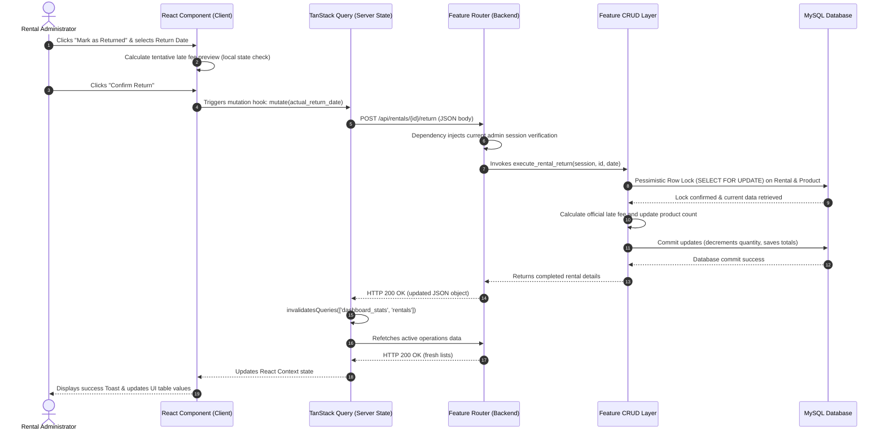

# Technical Design Document (TDD)

**Project:** Rental Management System (MVP)  
**Author:** Senior Principal Software Architect  
**Scope:** Folder structure, component breakdown, library installations, file responsibilities, and data flow.  

---

## 1. Introduction & Architectural Scope

This Technical Design Document (TDD) outlines the structural blueprint for executing the Rental Management System MVP. This design strictly decouples frontend presentation and client state from the backend API server and data management layer.

---

## 2. Codebase Folder Structure & File Tree

The workspace is organized into two primary project folders: `frontend` and `backend`. Below is the complete tree layout of all files required to construct the system.

### 2.1 Frontend File Tree (React + Vite)
```
frontend/
├── public/
│   └── favicon.ico
├── src/
│   ├── assets/               # Static resources
│   │   └── logo.svg
│   ├── components/           # UI components used EVERYWHERE
│   │   ├── ui/               # Reused primitive components (from Shadcn)
│   │   │   ├── button.tsx
│   │   │   ├── input.tsx
│   │   │   ├── dialog.tsx
│   │   │   ├── select.tsx
│   │   │   ├── table.tsx
│   │   │   ├── card.tsx
│   │   │   ├── badge.tsx
│   │   │   ├── toast.tsx
│   │   │   ├── use-toast.ts
│   │   │   └── skeleton.tsx
│   │   ├── Loader.tsx        # Global spinner
│   │   └── ConfirmationModal.tsx # Reusable double-check popups
│   ├── features/             # Main functional domains
│   │   ├── auth/             # Login flow & session validation
│   │   │   ├── components/
│   │   │   │   └── LoginForm.tsx
│   │   │   ├── hooks/
│   │   │   │   └── useLogin.ts
│   │   │   └── services/
│   │   │       └── authApi.ts
│   │   ├── dashboard/        # Operational metrics board
│   │   │   ├── components/
│   │   │   │   ├── StatCard.tsx
│   │   │   │   └── OperationsTable.tsx
│   │   │   ├── hooks/
│   │   │   │   └── useDashboardData.ts
│   │   │   └── services/
│   │   │       └── dashboardApi.ts
│   │   ├── products/         # Product catalog management
│   │   │   ├── components/
│   │   │   │   ├── ProductTable.tsx
│   │   │   │   ├── AddProductModal.tsx
│   │   │   │   └── EditProductModal.tsx
│   │   │   ├── hooks/
│   │   │   │   └── useProducts.ts
│   │   │   └── services/
│   │   │       └── productApi.ts
│   │   └── rentals/          # Rental bookings and settlements
│   │       ├── components/
│   │       │   ├── CreateRentalForm.tsx
│   │       │   ├── RentalSummary.tsx
│   │       │   └── ReturnRentalModal.tsx
│   │       ├── hooks/
│   │       │   └── useRentals.ts
│   │       └── services/
│   │           └── rentalApi.ts
│   ├── pages/                # High-level routing templates
│   │   ├── LoginPage.tsx
│   │   ├── DashboardPage.tsx
│   │   ├── ProductsPage.tsx
│   │   ├── NewRentalPage.tsx
│   │   └── RentalDetailPage.tsx
│   ├── services/             # Axios and HTTP base configuration
│   │   └── api.ts
│   ├── context/              # UI context patterns
│   │   └── SidebarContext.tsx
│   ├── utils/                # Helper utility code
│   │   ├── format.ts         # Date and currency formatters
│   │   └── validate.ts       # Regular expressions and inline field rules
│   ├── App.tsx
│   ├── index.css             # Tailwind imports and design system tokens
│   ├── main.tsx
│   └── vite-env.d.ts
├── tailwind.config.js
├── tsconfig.json
└── vite.config.ts
```

### 2.2 Backend File Tree (FastAPI)
```
backend/
├── app/
│   ├── core/                 # Shared core parameters
│   │   ├── config.py         # OS Environment variables loader
│   │   ├── database.py       # SQLAlchemy engine & session generation
│   │   └── security.py       # Password hashes & JWT encryption helpers
│   ├── features/             # Feature-based backend modules
│   │   ├── auth/             # Authentication & session verification
│   │   │   ├── router.py
│   │   │   ├── crud.py
│   │   │   ├── models.py     # SQLModel classes
│   │   │   └── schemas.py    # Pydantic schemas (requests/responses)
│   │   ├── products/         # Product catalog management
│   │   │   ├── router.py
│   │   │   ├── crud.py
│   │   │   ├── models.py
│   │   │   └── schemas.py
│   │   └── rentals/          # Rental bookings and settlements
│   │       ├── router.py
│   │       ├── crud.py
│   │       ├── models.py
│   │       └── schemas.py
│   └── main.py               # App runtime & global router initialization
├── migrations/               # Alembic configuration tracking scripts
│   ├── env.py
│   └── versions/
├── alembic.ini
├── requirements.txt
└── Dockerfile
```

---

## 3. Component & Module Breakdown

To deliver the MVP within a 6-hour window, the design relies heavily on headless primitives while structuring domain-specific components cleanly.

### 3.1 Components to Reuse (Install via Shadcn CLI)
The following components are imported from the **Shadcn UI** library:
*   `Button`: Extends Radix primitives, handles styling variants (default, outline, destructive).
*   `Input`: Standard HTML input wrappers with unified focus borders.
*   `Dialog`: Popovers and modals including accessibility focus traps.
*   `Select`: Customized HTML select dropdown elements.
*   `Table`: Simple grid wrappers for standardized layouts.
*   `Card`: Structured layout blocks for dashboard metrics.
*   `Badge`: Colored labels for rental states.
*   `Toast`: Auto-dismiss alerts on success and persistent indicators on errors.
*   `Skeleton`: Dynamic loading placeholder templates.

### 3.2 Components to Build from Scratch

#### Frontend:
*   `LoginForm`: A centralized authentication card validation utility that captures username and password, displaying local errors if credentials fail validation patterns.
*   `StatCard`: High-level operations container supporting currency formatting, custom icon overlays, hover transitions, and active-click filters.
*   `OperationsTable`: Custom table mapping rentals, embedding badge indicators, sorting chronologically by due dates, and binding navigations onto row clicks.
*   `CreateRentalForm`: Form UI that loads active products, calculates durations dynamically, and sets recommended deposits while allowing manual adjustments.
*   `ReturnRentalModal`: Modal dialog containing actual return date pickers and displaying computed late fees in real-time.
*   `ConfirmationModal`: General double-check warning wrapper containing confirmation checks for destructive actions (e.g. deletes).
*   `AppLayout` & `Sidebar`: The primary authenticated shell mapping navigation headers.

#### Backend:
*   `get_current_admin`: A custom FastAPI dependency that retrieves cookies, decodes the encrypted payload, and validates admin existence.
*   `calculate_rental_settlement`: Logic function that returns late-day intervals, applies daily rates, and caps penalties based on deposits.
*   `execute_create_rental`: Pessimistic database block preventing double-bookings.

---

## 4. External Libraries & Package Management

### 4.1 Frontend Packages (`frontend/package.json`)

| Package Name | Purpose | Usage / Integration Example |
|---|---|---|
| `@tanstack/react-query` | Syncs and caches server state | Wrap application root with `<QueryClientProvider>`. Access data using customized hook bindings (e.g. `useQuery`, `useMutation`). |
| `zustand` | Lightweight client state | Establish stores for volatile client configurations: `useAuthStore` and `useUiFilters`. |
| `react-router-dom` | Controls page transitions | Serves nested screens behind layout routing scopes and protects private directories. |
| `axios` | Configures HTTP calls | Set defaults (`withCredentials: true`) to automatically append authentication cookies on all requests. |
| `lucide-react` | Renders UI icons | Include context-specific vector graphics inside tables and navigation sidebars. |
| `date-fns` | Manipulates date calculations | Used for calendar delta calculations and converting date formats (`DD MMM YYYY`). |

**Usage Snippet: HTTP Request Client Setup (`src/services/api.ts`)**
```typescript
import axios from 'axios';

export const api = axios.create({
  baseURL: import.meta.env.VITE_API_URL || '/api',
  withCredentials: true, // Enables transfer of HTTPOnly cookies
  headers: {
    'Content-Type': 'application/json',
  },
});

// Interceptor to redirect to login on 401 Unauthorized
api.interceptors.response.use(
  (response) => response,
  (error) => {
    if (error.response && error.response.status === 401) {
      // Clear client session and redirect
      window.location.href = '/login';
    }
    return Promise.reject(error);
  }
);
```

### 4.2 Backend Packages (`backend/requirements.txt`)

| Package Name | Purpose | Integration Details |
|---|---|---|
| `fastapi` | REST API layer | Exposes routes, automatic parsing, and interactive Swagger UI. |
| `uvicorn` | ASGI web runner | Runs FastAPI in asynchronous event loops. |
| `sqlmodel` | Unified DB models | Declares data tables, validation rules, and schema structures. |
| `cryptography` | Handles data encryption | Provides lower-level cryptographical capabilities. |
| `passlib[argon2]` | Encrypts credentials | Hashes user passwords before database storage. |
| `pyjwt[crypto]` | Crypts session cookies | Signs and validates JWT structures containing user identities. |
| `pymysql` | MySQL database driver | Powers SQLAlchemy connections to MySQL/MariaDB database instances. |
| `alembic` | Schema migration tool | Generates and tracks database structure evolution histories. |

---

## 5. Architectural Directory Responsibilities

Every directory in the repository has a single, well-defined role:

### 5.1 Frontend Responsibilities

*   `src/assets/`: Holds physical layout files (e.g. logos, static images, global custom font definitions). No logic allowed.
*   `src/components/`: Houses UI components used globally (e.g. buttons, inputs, loaders). Must remain stateless and completely decoupled from business domain logic.
*   `src/features/`: Enforces domain encapsulation. Each sub-folder holds the logic, components, state hooks, and API definitions representing a singular business context.
    *   *Rule*: Features do not import from other features directly; sharing is executed only at the page page level.
*   `src/pages/`: Configures route entrypoints. Combines features and UI layouts, fetches initial parameters, and handles context errors.
*   `src/services/`: Configures Axios clients, defaults base settings, and sets interceptor rules.
*   `src/context/`: Manages layout-related states (e.g. theme toggle, sidebar expansion, temporary screen notifications).
*   `src/utils/`: Standard library functions (e.g. format currency values, clean date displays, execute regex validation). Must remain pure functions with zero side effects.

### 5.2 Backend Responsibilities

*   `app/core/`: Application configs, security settings, database session pooling, and helper tools.
*   `app/features/`: Groups application code by business domains (features) instead of technical layers. Each feature directory is self-contained:
    *   `router.py`: Handles HTTP routes, route-specific dependencies, and requests/responses validation.
    *   `crud.py`: Database query methods and transactional operations specific to the feature.
    *   `models.py`: SQLModel database declarations.
    *   `schemas.py`: Pydantic input/output validation shapes.
*   `migrations/`: Holds structural update scripts generated by Alembic.

---

## 6. State Management & Data Flow Patterns

The application separates state into three tiers:
1.  **Volatile Client UI State**: Handled locally via `useState` or globally via `Zustand` (e.g., table filter toggles, sidebar state).
2.  **Server State**: Handled using `TanStack Query`. Component state is synchronized with backend state through automated invalidation steps.
3.  **Persistence Layer**: Handled using `MySQL/MariaDB`, ensuring transaction security.

### Data Flow Diagram



---

## 7. Verification & Implementation Guidance

*   **Rule 1 (Purity)**: Ensure formatting functions in `src/utils/format.ts` are pure and covered by automated tests.
*   **Rule 2 (Single Source of Truth)**: Do not store API data inside local variables. Component state must update dynamically by invalidating cache queries.
*   **Rule 3 (Atomic Transactions)**: All inventory changes and return actions must reside inside transaction blocks to prevent data drift.
*   **Rule 4 (No Hardcoded URLs)**: Use relative paths inside project code and configure baseURL dynamics via environmental configs.
