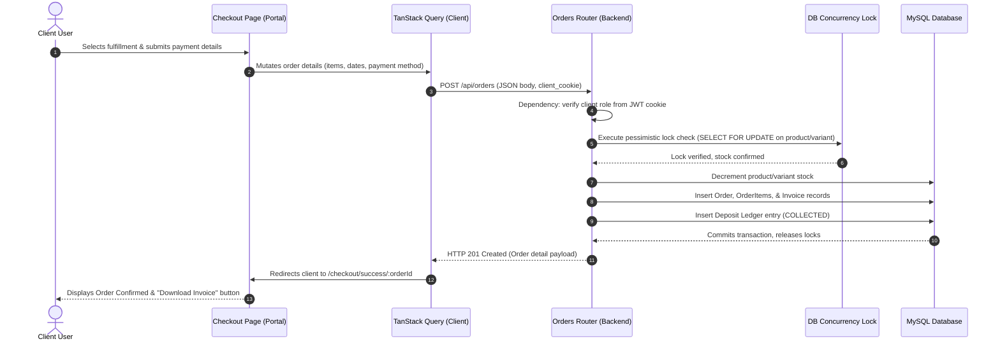
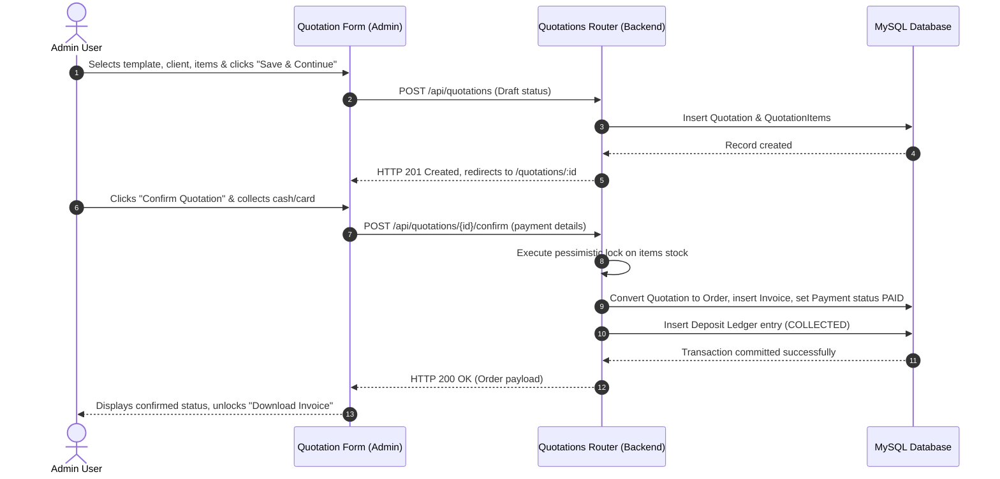
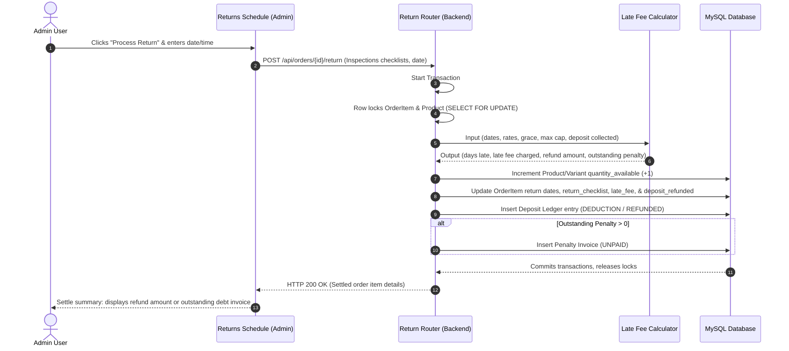

# Technical Design Document (TDD)

**Project:** Rental Management System (MVP)  
**Author:** Senior Principal Software Architect  
**Scope:** Folder structures, component breakdowns, file responsibilities, and workflow sequence diagrams for the dual-surface RMS.

---

## 1. Introduction & Architectural Scope

This Technical Design Document (TDD) specifies the implementation details for the dual-surface Rental Management System. This decoupled system features a Client Portal React SPA, an Admin Backend React SPA, and a shared FastAPI server using a MySQL database.

---

## 2. Codebase Folder Structure & File Tree

### 2.1 Frontend File Tree (React + Vite)
```
frontend/
├── public/
│   └── favicon.ico
├── src/
│   ├── assets/               # Static icons, logos
│   │   └── logo.svg
│   ├── components/           # Core shared UI elements
│   │   ├── ui/               # Headless elements installed via Shadcn
│   │   │   ├── button.tsx
│   │   │   ├── input.tsx
│   │   │   ├── dialog.tsx
│   │   │   ├── select.tsx
│   │   │   ├── table.tsx
│   │   │   ├── card.tsx
│   │   │   ├── badge.tsx
│   │   │   ├── toast.tsx
│   │   │   └── skeleton.tsx
│   │   ├── Loader.tsx        # Inline skeleton/spinner wrappers
│   │   └── ConfirmDialog.tsx # Double-check warning dialog
│   ├── layouts/              # Screen containers
│   │   ├── ClientLayout.tsx  # Persistent nav layout for clients
│   │   └── AdminLayout.tsx   # Left sidebar dashboard shell for admins
│   ├── features/             # Domain modules
│   │   ├── auth/             # Login/registration components
│   │   │   ├── components/LoginForm.tsx, SignupForm.tsx
│   │   │   ├── hooks/useAuth.ts
│   │   │   └── services/authApi.ts
│   │   ├── catalog/          # Products, variants, pricelists, periods
│   │   │   ├── components/ProductGrid.tsx, ProductTable.tsx, VariantSelector.tsx, PeriodPicker.tsx
│   │   │   ├── hooks/useCatalog.ts, usePricelists.ts
│   │   │   └── services/catalogApi.ts
│   │   ├── orders/           # Shopping cart, checkout steps, payments, client order lists
│   │   │   ├── components/CartList.tsx, FulfillmentForm.tsx, PaymentForm.tsx, ClientOrderTable.tsx
│   │   │   ├── hooks/useOrders.ts, useCart.ts
│   │   │   └── services/ordersApi.ts
│   │   ├── quotations/       # In-store quotations, template editors
│   │   │   ├── components/QuotationForm.tsx, QuotationTable.tsx
│   │   │   ├── hooks/useQuotations.ts
│   │   │   └── services/quotationsApi.ts
│   │   └── operations/       # Pickup/return processing, checklist modals, settings forms
│   │       ├── components/PickupSchedule.tsx, ReturnSchedule.tsx, ReturnChecklistModal.tsx, SettingsForm.tsx
│   │       ├── hooks/useOperations.ts, useSettings.ts
│   │       └── services/operationsApi.ts
│   ├── pages/                # Route level entry containers
│   │   ├── client/           # Client views
│   │   │   ├── BrowsePage.tsx, DetailPage.tsx, CartPage.tsx, CheckoutPage.tsx, SuccessPage.tsx, MyRentalsPage.tsx
│   │   └── admin/            # Admin views
│   │       ├── DashboardPage.tsx, ProductAdminPage.tsx, PricelistAdminPage.tsx, QuotationAdminPage.tsx, OrdersAdminPage.tsx
│   ├── services/             # Axios base settings & interceptors
│   │   └── api.ts
│   ├── store/                # Zustand stores
│   │   ├── authStore.ts
│   │   └── cartStore.ts
│   ├── utils/                # Date & currency formatters
│   │   ├── format.ts
│   │   └── validate.ts
│   ├── App.tsx               # Route configurations
│   ├── index.css             # Tailwind setup and styles
│   └── main.tsx
```

### 2.2 Backend File Tree (FastAPI)
```
backend/
├── app/
│   ├── core/                 # Engine setups, config loaders
│   │   ├── config.py
│   │   ├── database.py
│   │   └── security.py
│   ├── features/             # Vertical features modules
│   │   ├── auth/             # Multi-role authentication & registration
│   │   │   ├── router.py, crud.py, models.py, schemas.py
│   │   ├── catalog/          # Products, variants, pricelists, periods
│   │   │   ├── router.py, crud.py, models.py, schemas.py
│   │   ├── quotations/       # Walking quotation creation & invoices
│   │   │   ├── router.py, crud.py, models.py, schemas.py
│   │   ├── orders/           # Invoices, ledger updates, cart checkouts
│   │   │   ├── router.py, crud.py, models.py, schemas.py
│   │   └── operations/       # Pickups, returns, late math, dashboard stats
│   │       ├── router.py, crud.py, models.py, schemas.py
│   └── main.py               # Global router wires
```

---

## 3. Component & Module Breakdown

### 3.1 Reusable UI Primitives (Installed via Shadcn CLI)
*   `Button`, `Input`, `Dialog` (for modals), `Select`, `Table`, `Card`, `Badge`, `Toast`.

### 3.2 Custom Components to Build

#### Frontend / Portal:
*   `ProductGrid` & `ProductCard`: Responsive catalog display for Client Portal.
*   `PeriodPicker`: Date range selector validating inventory availability and calculating rental rates.
*   `CartList`: Display line items, rental periods, deposits, and allow removals.
*   `FulfillmentForm`: Choice between home delivery (prefilled address form) and store pickup.
*   `PaymentForm`: Checkout payment processing (Rental fee + Security Deposit).

#### Admin Backend:
*   `StatCard`: Metric cards showing counts, revenue, and deposit values.
*   `QuotationForm`: Offline quotation creation tool utilizing templates.
*   `PickupSchedule` & `ReturnSchedule`: Lists of upcoming checkouts and returns scheduled for the day.
*   `ReturnChecklistModal`: Process items return, checklist logs, and calculate real-time late fees.
*   `SettingsForm`: Configuration panels for late-fee calculation intervals and default deposit rates.

---

## 4. External Libraries & Package Management

### 4.1 Frontend Packages
*   `@tanstack/react-query`: Server state synchronization and query caching.
*   `zustand`: Light client-side stores (`cartStore` and `authStore`).
*   `react-router-dom`: SPA client routes and route role checks.
*   `axios`: HTTP request engine configured with `withCredentials: true` to attach JWT cookies.
*   `date-fns`: Calculations of dates, durations, and late intervals.

### 4.2 Backend Packages
*   `fastapi`: Framework for REST API endpoints.
*   `uvicorn[standard]`: ASGI execution runner.
*   `sqlmodel`: Database abstractions combining ORM structures with Pydantic parameters.
*   `pymysql`: MySQL relational connector driver.
*   `passlib[argon2]`: Password credential hashing.
*   `pyjwt[crypto]`: Safe JSON Web Token generation.
*   `alembic`: Sequential schema migrations.

---

## 5. Architectural Directory Responsibilities

*   `src/components/`: Stateless shared layout assets.
*   `src/features/`: Enforced domain boundaries (Auth, Catalog, Orders, Quotations, Operations). Features must not depend directly on sibling feature structures.
*   `src/pages/`: Integrates layouts and features, fetches initial page data, and manages route parameters.
*   `app/core/`: Session configurations, database setups, and global security rules.
*   `app/features/`: Vertical domain directories mapping routers, schemas, and queries.

---

## 6. Sequence Diagrams & Workflow Traces

### 6.1 Client Portal Checkout Flow


### 6.2 Admin Walk-in Quotation & Confirm Flow


### 6.3 Return Settle & Reconciliation Flow

