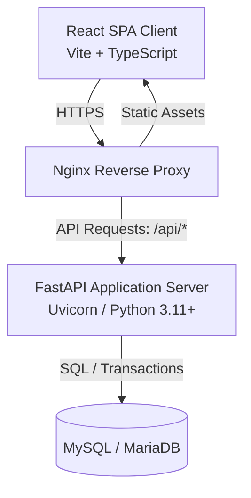

# Full-Stack Technical Requirements Document (TRD)

**Project:** Rental Management System (MVP)  
**Author:** Principal Software Architect  
**Scope:** Single-role Admin dashboard, tracking rentals, products, and deposit settlements  
**Target Delivery:** 6-hour MVP Build  

---

## 1. Executive Summary & Tech Stack Overview

This document defines the technical architecture and specifications for the Rental Management System MVP. The objective is to deliver a highly reliable, responsive, and secure single-admin system for managing rental operations, product catalogs, and deposits.

### Core Technology Stack



*   **Frontend**: React (TypeScript), Vite (Build tool & Dev server), Tailwind CSS (Utility styling), Shadcn UI + Radix UI (Component primitives).
*   **Backend**: Python (3.11+), FastAPI (Web framework), Uvicorn (ASGI web server).
*   **Database & ORM**: MySQL 8.0+ or MariaDB 10.5+, SQLAlchemy 2.0 + SQLModel (Data models, schemas, and queries), Alembic (Schema migrations).
*   **Authentication**: Stateless JWT-based authentication, transmitted via secure, HttpOnly cookies.

---

## 2. System Architecture & Component Interaction

The application operates as a decoupled client-server architecture:
1.  **Frontend SPA**: A single-page application built with React, compiled into static HTML/JS/CSS assets, and served via **Nginx**.
2.  **Backend REST API**: A stateless ASGI python server exposing JSON endpoints.
3.  **Database**: A relational database instance handling transaction-safe (ACID) updates.
4.  **Reverse Proxy**: In production, Nginx acts as the single point of entry, routing requests to the static frontend directory or proxying `/api` traffic to the FastAPI server while enforcing SSL/TLS termination.

---

## 3. Frontend Architecture

The frontend is structured to maximize responsiveness, type-safety, and visual polished elegance.

### 3.1 Directory Structure
```
frontend/
├── public/
├── src/
│   ├── assets/             # Icons, static branding
│   ├── components/         # Reusable Shadcn/Radix components
│   │   └── ui/             # Core primitives (buttons, inputs, dialogs)
│   ├── features/           # Feature-based folders
│   │   ├── auth/           # Login, state, forms
│   │   ├── dashboard/      # Operation stats, list tables
│   │   ├── products/       # Product list, modals
│   │   └── rentals/        # Creation form, details, return modals
│   ├── hooks/              # Global custom React hooks
│   ├── layouts/            # Sidebar, Topbar, AuthShell, AppShell
│   ├── routes/             # Route configurations and Auth guards
│   ├── services/           # Axios instance, api service clients
│   ├── store/              # Zustand global client stores
│   ├── types/              # Shared TypeScript definitions
│   ├── App.tsx
│   └── main.tsx
├── package.json
├── tailwind.config.js
└── vite.config.ts
```

### 3.2 State Management & Data Fetching
*   **Server State (React Query / TanStack Query)**: Used for all data fetching, caching, loading states, and mutations.
    *   *Query Keys*: `['dashboard_stats']`, `['products']`, `['rentals']`, `['rental', id]`.
    *   *Stale Time*: 10 seconds for real-time operation dashboard data.
    *   *Mutations*: Cache invalidation occurs on successful mutations (`invalidateQueries`) to trigger automatic, silent UI updates.
*   **Client State (Zustand)**: Used for global client-only state variables.
    *   `authStore`: Holds user metadata (`username`) and authentication status (boolean).
    *   `uiStore`: Holds sidebar collapsed state and current table filters active on the dashboard.

### 3.3 Routing & Navigation (React Router v6)
*   **Unauthenticated Shell**: `/login` (Auth Guard redirects authenticated admins to `/dashboard`).
*   **Authenticated Shell**: Persistent Left Sidebar navigation containing `Dashboard` | `Rentals` | `Products` and `Logout` actions.
*   **Route Setup**:
    ```typescript
    // Router structure snippet
    const routes = [
      { path: "/login", element: <LoginScreen /> },
      {
        path: "/",
        element: <ProtectedRoute><AppLayout /></ProtectedRoute>,
        children: [
          { path: "dashboard", element: <DashboardScreen /> },
          { path: "products", element: <ProductListScreen /> },
          { path: "rentals", element: <RentalDetailScreen /> },
          { path: "rentals/new", element: <CreateRentalScreen /> },
          { path: "rentals/:id", element: <RentalDetailScreen /> },
        ]
      }
    ];
    ```

### 3.4 Key Visual Styles & Themes
Following the design guidelines, the UI must have a premium feel:
*   **Color Palette**: Sleek dark-mode first design, featuring rich charcoal backgrounds (`#09090b`), slate grays, and electric indigo (`#6366f1`) or emerald green highlights for positive values, amber/crimson for alerts and overdue items.
*   **Typography**: Inter or Outfit font family, with modern sizing hierarchies.
*   **Micro-Animations**: Transitions on hover for sidebar icons, row clicks, and button clicks. Core metrics count up animations.

---

## 4. Backend API Architecture

The backend is built around FastAPI to take advantage of automatic OpenAPI documentation generation, high async performance, and seamless validation with Pydantic.

### 4.1 Folder Structure
```
backend/
├── app/
│   ├── core/               # Global configurations, security, DB engine
│   │   ├── config.py
│   │   ├── database.py
│   │   └── security.py
│   ├── features/           # Feature-based backend modules
│   │   ├── auth/           # Authentication features
│   │   ├── products/       # Product catalog features
│   │   └── rentals/        # Rental booking and return features
│   └── main.py             # App initialization & routing setup
├── migrations/             # Alembic environment & revision scripts
├── alembic.ini
├── requirements.txt
└── Dockerfile
```

### 4.2 Rest API Endpoints Specification

| Method | Endpoint | Description | Request Body / Query Params | Success Code | Error Codes |
|---|---|---|---|---|---|
| `POST` | `/api/auth/login` | Login, sets HTTPOnly access cookie | `{username, password}` | `200 OK` | `400`, `401` |
| `POST` | `/api/auth/logout` | Clears cookie session | None | `204 No Content`| `401` |
| `GET` | `/api/auth/me` | Fetch active user session details | None | `200 OK` | `401` |
| `GET` | `/api/products` | Retrieve product catalog list | None | `200 OK` | `401` |
| `POST` | `/api/products` | Create a product in catalog | `{name, daily_rate, deposit_amount, quantity_available}` | `201 Created` | `400`, `401` |
| `PUT` | `/api/products/{id}` | Edit product in catalog | `{name, daily_rate, deposit_amount, quantity_available}` | `200 OK` | `400`, `401`, `404` |
| `DELETE` | `/api/products/{id}`| Remove product from catalog | None | `200 OK` | `400`, `401`, `404` |
| `GET` | `/api/rentals` | List all rentals with optional filters | `?status=Active\|Overdue\|Completed` | `200 OK` | `401` |
| `POST` | `/api/rentals` | Book/create a new rental | `{product_id, customer_name, customer_phone, start_date, due_date, deposit_amount}` | `201 Created` | `400`, `401`, `409` |
| `GET` | `/api/rentals/{id}` | Get rental details | None | `200 OK` | `401`, `404` |
| `POST` | `/api/rentals/{id}/return` | Mark returned & settle deposit | `{actual_return_date}` | `200 OK` | `400`, `401`, `404` |
| `GET` | `/api/dashboard/stats` | Fetch aggregate count totals | None | `200 OK` | `401` |

### 4.3 Late Fee Logic Implementation Details

When processing a return, the backend must execute the late fee logic deterministically.
The logic parameters:
*   **Days Overdue**: Computed as $D_{\text{overdue}} = \text{Actual Return Date} - \text{Due Date}$. If $D_{\text{overdue}} \le 0$, the rental was returned on time (0 days late).
*   **Late Fee**: $F_{\text{late}} = D_{\text{overdue}} \times \text{Product Daily Rate}$.
*   **Deposit Capping**: The late fee is capped at the collected deposit amount:
    $$F_{\text{final}} = \min(F_{\text{late}}, D_{\text{collected}})$$
*   **Refund Due**: $R_{\text{refund}} = D_{\text{collected}} - F_{\text{final}}$.

#### Python Reference Implementation (Internal Logic):
```python
from datetime import date
from decimal import Decimal

def calculate_rental_settlement(
    due_date: date,
    actual_return_date: date,
    daily_rate: Decimal,
    deposit_collected: Decimal
) -> dict:
    if actual_return_date <= due_date:
        days_late = 0
        late_fee = Decimal("0.00")
        refund_amount = deposit_collected
    else:
        days_late = (actual_return_date - due_date).days
        late_fee = Decimal(days_late) * daily_rate
        # Enforce deposit cap
        late_fee = min(late_fee, deposit_collected)
        refund_amount = deposit_collected - late_fee

    return {
        "days_late": days_late,
        "late_fee_charged": late_fee,
        "deposit_refunded": refund_amount
    }
```

---

## 5. Database Schema & Migration Strategy

We utilize a relational MySQL/MariaDB database to guarantee strict foreign keys constraints and transactional execution.

### 5.1 Entity Relationship Diagram & Schemas

```
  +------------------+             +--------------------+
  |      admins      |             |      products      |
  +------------------+             +--------------------+
  | PK  id           |             | PK  id             |
  |     username     |<--+         |     name           |
  |     pass_hash    |   |         |     daily_rate     |
  +------------------+   |         |     deposit_amount |
                         |         |     qty_available  |
                         |         +--------------------+
                         |                   |
                         | 1                 | 1
                         |                   |
                         |                   | Many
                         |                   v
                         |         +--------------------+
                         |         |      rentals       |
                         |         +--------------------+
                         |         | PK  id             |
                         |         | FK  product_id     |
                         |         |     customer_name  |
                         |         |     customer_phone |
                         |         |     start_date     |
                         |         |     due_date       |
                         |         |     deposit_amount |
                         |         |     return_date    |
                         |         |     late_fee       |
                         |         |     refund_amount  |
                         |         |     settled_at     |
                         +--------|     settled_by     | (Optional auditor trail)
                                   +--------------------+
```

#### SQL Schema Declarations (via SQLModel / SQLAlchemy)

```python
from datetime import date, datetime
from decimal import Decimal
from typing import Optional
from sqlmodel import SQLModel, Field, Relationship

class Admin(SQLModel, table=True):
    __tablename__ = "admins"
    id: Optional[int] = Field(default=None, primary_key=True)
    username: str = Field(index=True, unique=True, nullable=False)
    password_hash: str = Field(nullable=False)

class Product(SQLModel, table=True):
    __tablename__ = "products"
    id: Optional[int] = Field(default=None, primary_key=True)
    name: str = Field(max_length=100, index=True, nullable=False)
    daily_rate: Decimal = Field(default=0.0, max_digits=10, decimal_places=2)
    deposit_amount: Decimal = Field(default=0.0, max_digits=10, decimal_places=2)
    quantity_available: int = Field(default=0)

class Rental(SQLModel, table=True):
    __tablename__ = "rentals"
    id: Optional[int] = Field(default=None, primary_key=True)
    product_id: int = Field(foreign_key="products.id", nullable=False)
    customer_name: str = Field(max_length=100, index=True, nullable=False)
    customer_phone: str = Field(max_length=20, index=True, nullable=False)
    start_date: date = Field(nullable=False)
    due_date: date = Field(index=True, nullable=False)
    deposit_amount: Decimal = Field(max_digits=10, decimal_places=2, nullable=False)
    
    # Settlement columns (Null until returned/settled)
    actual_return_date: Optional[date] = Field(default=None, nullable=True)
    late_fee_charged: Optional[Decimal] = Field(default=None, max_digits=10, decimal_places=2, nullable=True)
    deposit_refunded: Optional[Decimal] = Field(default=None, max_digits=10, decimal_places=2, nullable=True)
    settled_at: Optional[datetime] = Field(default=None, index=True, nullable=True)
```

### 5.2 Key Indexing Strategy
To ensure swift operations when rendering dashboard lists and stat metrics, the following indexes are generated:
1.  `idx_rentals_due_status`: Composite index on `(due_date, actual_return_date)` to instantly retrieve **Due Today** and **Overdue** rentals where return date is `NULL`.
2.  `idx_rentals_active`: Index on `actual_return_date` to isolate all active rentals (which have `actual_return_date IS NULL`).
3.  `idx_products_name`: Index on `products.name` for fast product identification.
4.  `idx_rentals_customer_phone`: Index on phone numbers to support lookup search.

### 5.3 Concurrency Control & Inventory Management
A critical race condition exists if two admins attempt to rent out the last item of a product simultaneously. To handle this, the MVP employs **Pessimistic Locking** inside database transaction blocks when creating rentals.

```python
# Concurrency Lock Logic during Create Rental
from sqlalchemy import select
from sqlmodel import Session
from fastapi import HTTPException, status

def execute_create_rental(session: Session, rental_data: RentalInput) -> Rental:
    # 1. Start / utilize the transaction block
    with session.begin_nested() as transaction:
        # 2. Lock the product row to prevent concurrent modification
        product = session.exec(
            select(Product)
            .where(Product.id == rental_data.product_id)
            .with_for_update() # Locks the row until transaction commits/rolls back
        ).first()
        
        if not product:
            raise HTTPException(status_code=404, detail="Product not found")
            
        # 3. Check inventory
        if product.quantity_available <= 0:
            raise HTTPException(
                status_code=status.HTTP_409_CONFLICT,
                detail="This product is no longer available."
            )
            
        # 4. Decrement availability counter
        product.quantity_available -= 1
        session.add(product)
        
        # 5. Create Rental record
        new_rental = Rental(
            product_id=product.id,
            customer_name=rental_data.customer_name,
            customer_phone=rental_data.customer_phone,
            start_date=rental_data.start_date,
            due_date=rental_data.due_date,
            deposit_amount=rental_data.deposit_amount, # Admin customized or default
        )
        session.add(new_rental)
        
    # Transaction commits here, locks are released automatically
    return new_rental
```

When processing returns, a reverse transaction must run:
1.  Lock the rental row (`FOR UPDATE`) to ensure it hasn't already been marked as returned.
2.  Lock the referenced product row (`FOR UPDATE`) and increment `quantity_available` by 1.
3.  Save the calculated fees and commit.

---

## 6. Authentication & Authorization Scheme

The MVP runs on a secure, single-role admin permission scheme.

### 6.1 Authentication Mechanism
*   **Credential Validation**: Credentials submitted via `/api/auth/login` are validated against hash records inside the `admins` table.
*   **Token Generation**: On success, the API signs a JWT containing the administrator's ID and an expiration timestamp (e.g. 12 hours).
*   **Cookie Delivery**: The JWT is sent back inside the `Set-Cookie` response header:
    *   `HttpOnly`: Prevents client-side scripts (JS) from accessing the token, eliminating XSS token theft vectors.
    *   `Secure`: Ensures the cookie is only transmitted over HTTPS connections (must be disabled for localhost testing, configured via config variables).
    *   `SameSite=Strict`: Instructs the browser to only attach the cookie on requests originating from the site's primary domain, acting as a mitigation against CSRF attacks.
*   **Logout**: `/api/auth/logout` sends a response header that expires the cookie immediately.

---

## 7. Security Rules & Audits

### 7.1 Cross-Origin Resource Sharing (CORS)
*   Production CORS configurations must explicitly list permitted origins (e.g. `https://admin.rentalapp.com`).
*   Wildcard entries (`*`) are disallowed because `allow_credentials=True` is required to pass the HTTPOnly cookies.

### 7.2 Rate Limiting
*   Apply rate limits on critical endpoints using a custom FastAPI middleware or standard libraries like SlowAPI (utilizing Redis or memory backend).
    *   `/api/auth/login`: Maximum 5 attempts per IP per 5-minute window.
    *   Write endpoints (`POST`/`PUT`/`DELETE`): Maximum 60 requests per minute per IP.

### 7.3 Input Validation & Sanitization
*   **Pydantic schemas** enforce type validation, range restrictions (e.g., `daily_rate > 0`, `quantity_available >= 0`), and string limits.
*   All strings must undergo HTML-escaping / parsing before storage to prevent script injection.

---

## 8. Deployment & CI/CD Pipeline

To ensure the application remains stable and simple to deploy, we dockerize both environments.

### 8.1 Docker Containerization

#### Frontend: Multi-stage Build (`frontend/Dockerfile`)
```dockerfile
# Stage 1: Build static assets
FROM node:20-alpine AS build
WORKDIR /app
COPY package*.json ./
RUN npm ci
COPY . .
RUN npm run build

# Stage 2: Serve via Nginx
FROM nginx:alpine
COPY --from=build /app/dist /usr/share/nginx/html
COPY nginx.conf /etc/nginx/conf.d/default.conf
EXPOSE 80
CMD ["nginx", "-g", "daemon off;"]
```

*Note: The custom `nginx.conf` must contain a fallback block to redirect all non-file route requests back to `index.html` to support React Router client-side routing:*
```nginx
location / {
    try_files $uri $uri/ /index.html;
}
```

#### Backend: App Server Build (`backend/Dockerfile`)
```dockerfile
FROM python:3.11-slim
WORKDIR /app
ENV PYTHONDONTWRITEBYTECODE=1 \
    PYTHONUNBUFFERED=1
COPY requirements.txt .
RUN pip install --no-cache-dir -r requirements.txt
COPY . .
EXPOSE 8000
CMD ["uvicorn", "app.main:app", "--host", "0.0.0.0", "--port", "8000"]
```

### 8.2 CI/CD GitHub Actions Pipeline
The pipeline runs on every push to the `main` branch or pull requests:
1.  **Code Check Phase**: Run eslint, prettier, and typescript compilation check on frontend. Run black, flake8, and mypy on backend.
2.  **Test Phase**: Run unit tests (via Vitest on frontend, and Pytest with a testing SQLite/MySQL database on backend).
3.  **Build Phase**: Compile frontend, build Docker images, and push them to a private container registry.
4.  **Deploy Phase**: Deliver a webhook trigger or execute a secure SSH deployment command to run a pull-and-restart script using `docker-compose.prod.yml` on the host server.

---

## 9. Technical Trade-offs & Architecture Decisions (ADRs)

### ADR 1: React SPA (Vite) vs. Server-Side Rendering (Next.js)
*   **Choice**: React Single Page Application (SPA) driven by Vite.
*   **Rationale**: The system is designed entirely as an internal operations dashboard restricted behind an admin authentication wall. There are no SEO requirements or web crawler crawling requirements. An SPA gives a highly fluid, desktop-like app experience with zero page redraw delays. Vite provides blazing-fast compile times, simplifying development for a rapid 6-hour iteration.

### ADR 2: MySQL/MariaDB vs. PostgreSQL
*   **Choice**: MySQL / MariaDB (as specified by user requirements).
*   **Rationale**: MySQL/MariaDB offers complete ACID compliance, transaction handling, and pessimistic locking capabilities (`FOR UPDATE`) required to secure deposit accounts and product counts. It requires lower memory overhead relative to PostgreSQL out of the box, facilitating hosting on cheaper, single-core virtual private servers.

### ADR 3: Combined Model Declarations with SQLModel
*   **Choice**: Using SQLModel for the database schemas and serialization.
*   **Rationale**: Historically, python web apps require writing two distinct classes for every entity: a SQLAlchemy class for DB mappings and a Pydantic class for input/output serialization. SQLModel merges these, preventing duplicate field declarations, reducing file counts, and ensuring full IDE auto-complete type support.

### ADR 4: Cookie-based Session JWT vs. LocalStorage JWT
*   **Choice**: HttpOnly Cookie-based transmission of stateless JWT.
*   **Rationale**: LocalStorage lacks standard security sandboxing, leaving keys open to theft if an admin is compromised via a cross-site scripting (XSS) attack. By serving JWTs via `HttpOnly` and `Secure` cookies, the browser acts as a sandbox, preventing JavaScript access entirely. Cross-Site Request Forgery (CSRF) is resolved by attaching `SameSite=Strict`.

### ADR 5: Deferring Customer Portals and Payment Integrations
*   **Choice**: Complete omission of customer-facing components in MVP.
*   **Rationale**: The core loop is tracking deposits and returns. Introducing customer portals requires complex public registration workflows, email verifications, and credit card gateway compliance (PCI). Keeping it strictly admin-driven simulates a notebook/spreadsheet workflow, proving the business value instantly before expanding development scope.
