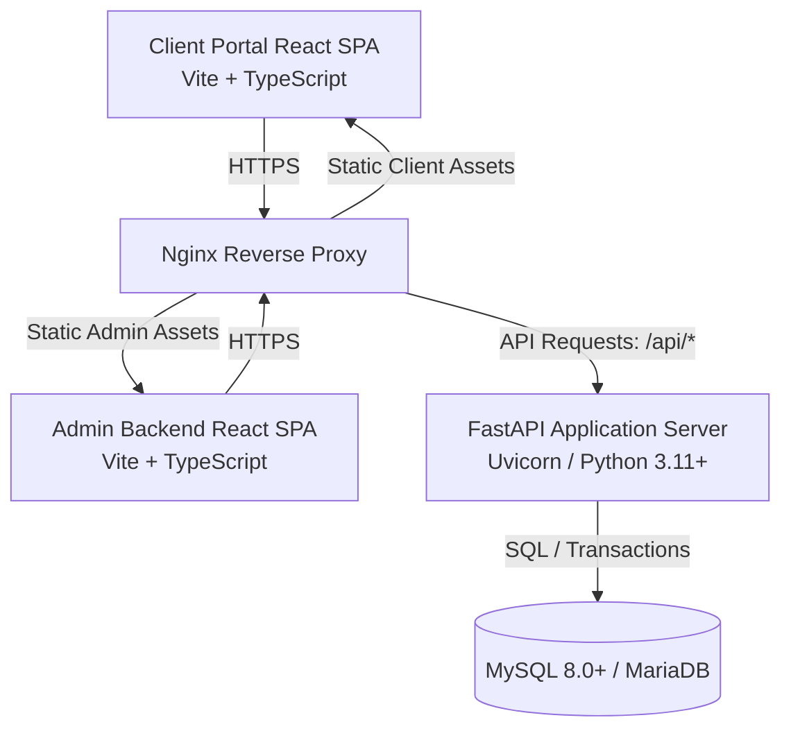

# Full-Stack Technical Requirements Document (TRD)

**Project:** Rental Management System (MVP)  
**Author:** Principal Software Architect  
**Scope:** Dual-surface application (Client Portal & Admin Backend)  
**Target Delivery:** 18-hour MVP Build  

---

## 1. Executive Summary & Tech Stack Overview

This document defines the technical architecture and specifications for the Rental Management System. The system supports two distinct user surfaces:
1.  **Client Portal** (served on client domain/route): Enables users to register, browse products, configure rental periods, manage carts, checkout (with delivery or store pickup), pay rental fees plus deposits, and track orders.
2.  **Admin Backend** (served on admin domain/route): Enables administrators to configure late fee/deposit parameters, manage catalogs (with products, variants, pricelists, and periods), create walk-in quotations, issue invoices, and manage daily pickups and returns.

### Core Technology Stack



*   **Frontend**: React 19 (TypeScript), Vite (Build tool & Dev server), Tailwind CSS v4 (Utility styling), Shadcn UI + Radix UI (Component primitives).
*   **Backend**: Python (3.11+), FastAPI (Web framework), Uvicorn (ASGI web server).
*   **Database & ORM**: MySQL 8.0+ / MariaDB 10.5+, SQLModel (unified SQLAlchemy 2.0 ORM + Pydantic v2 schemas), Alembic (schema migrations).
*   **Authentication**: Stateless JWT-based authentication via cookie delivery (`HttpOnly`, `SameSite=Strict`, `Secure` when HTTPS enabled). Distinct cookie scopes for Clients (`client_session`) and Admins (`admin_session`).

---

## 2. System Architecture & Component Interaction

The application uses a decoupled client-server architecture:
1.  **Frontend SPAs**: Two React builds. In production, Nginx serves the Client Portal from the root domain (`app.rentalsystem.com` or path `/`) and the Admin Backend from the admin subdomain (`admin.rentalsystem.com` or path `/admin`).
2.  **Backend REST API**: A single, stateless Python application server exposing JSON endpoints under `/api`.
3.  **Database**: A relational database instance handling transaction-safe (ACID) updates.
4.  **Reverse Proxy**: In production, Nginx handles SSL/TLS termination, routes static requests to their respective build directories, and forwards `/api/*` traffic to the FastAPI server.

---

## 3. Frontend Architecture

The frontend uses a structured, feature-grouped pattern ensuring Client and Admin modules remain separate.

### 3.1 Directory Structure
```
frontend/
├── public/
├── src/
│   ├── assets/               # Static resources
│   ├── components/           # Reusable Shadcn/Radix primitives (buttons, inputs)
│   │   └── ui/
│   ├── features/             # Feature modules (isolated domains)
│   │   ├── auth/             # Shared & specific login/signup flows
│   │   ├── dashboard/        # Admin dashboard widgets & KPI cards
│   │   ├── catalog/          # Products, variants, pricelists, periods (Admin & Client)
│   │   ├── quotations/       # Walk-in quotation templates & creator
│   │   ├── orders/           # Booking flows, cart, checkouts, and detail states
│   │   └── operations/       # Pickup & return schedules, checklists, settlements
│   ├── hooks/                # Global React hooks
│   ├── layouts/              # Client & Admin shell wrappers
│   ├── routes/               # Routes and separate Auth guards
│   ├── services/             # Axios API clients
│   ├── store/                # Zustand global stores (Zustand client UI states)
│   ├── types/                # Central TypeScript definitions
│   ├── utils/                # Pure formatters and validators
│   ├── App.tsx
│   └── main.tsx
```

### 3.2 State Management & Data Fetching
*   **TanStack Query (React Query)**: Synchronizes server state.
    *   *Query Keys*: `['dashboard_stats']`, `['products']`, `['product_variants', productId]`, `['pricelists']`, `['rental_periods']`, `['orders']`, `['order', id]`, `['quotations']`, `['deposits']`.
    *   *Stale Time*: 10 seconds for real-time dashboards; 5 minutes for static entities like rental periods.
    *   *Invalidation*: Mutating actions invalidate their respective query keys to prompt automatic, background UI refreshes.
*   **Zustand**: Client-only volatile state.
    *   `authStore`: Holds user profiles, roles, and auth states.
    *   `cartStore`: Manages cart selections, rental dates, and line items.
    *   `uiStore`: Controls layout adjustments (sidebar collapses, active tables, filter state).

### 3.3 Routing & Navigation (React Router v6)
Two distinct route structures are wrapped with separate auth guards:
*   **Client Routes**:
    *   `/splash` (Guest cold-start check)
    *   `/login` / `/signup` (Guest)
    *   `/` (Client Home / Product Browse)
    *   `/products/:id` (Product details & date configurations)
    *   `/cart` (Cart summary & checkout validation)
    *   `/checkout/fulfillment` (Delivery vs. Store Pickup)
    *   `/checkout/payment` (Rental + Deposit pay action)
    *   `/checkout/success/:orderId` (Confirmation & Invoice download)
    *   `/my-rentals` / `/my-rentals/:orderId` (User order history)
    *   `/profile` / `/profile/address` / `/profile/payment-info` (User configurations)
*   **Admin Routes**:
    *   `/login` (Guest Admin login)
    *   `/dashboard` (Protected Admin landing page)
    *   `/products`, `/products/new`, `/products/:id/edit` (Catalog settings)
    *   `/pricelists`, `/pricelists/new`, `/pricelists/:id/edit` (Pricelist parameters)
    *   `/rental-periods` (Duration definitions)
    *   `/settings/deposit-latefee` (Rules config)
    *   `/quotations`, `/quotations/new`, `/quotations/:id` (Walk-in quotation tool)
    *   `/orders`, `/orders/:id` (Order overview & processing)
    *   `/pickups`, `/returns` (Daily schedules & checklists)
    *   `/deposits` (Deposit ledger history)
    *   `/users` (Client record viewer)

### 3.4 Key Visual Styles & Themes
Following the design guidelines (Notion inspired design system):
*   **Canvas Canvas-Soft**: Warm off-white `#f6f5f4` for the primary screen background, contrasted with pure `#ffffff` cards and panels to avoid cold clinical white layouts.
*   **Typography**: Inter or Outfit fonts. Displays use heavy weight 700 with negative letter spacing (e.g. `-2px` on H1s).
*   **Accents**: Notion Blue `#0075de` is reserved strictly for actions and links. Distinct color-block indicators from the sticker palette decorate statuses (Active = Green, Overdue = Red, Upcoming = Blue).

---

## 4. Backend API Architecture

The backend exposes a single, stateless ASGI REST API.

### 4.1 Folder Structure
```
backend/
├── app/
│   ├── core/                 # Shared configs, engine pools, security rules
│   │   ├── config.py
│   │   ├── database.py
│   │   └── security.py
│   ├── features/             # Vertical slices grouped by domain
│   │   ├── auth/             # Portal & Admin auth details
│   │   ├── catalog/          # Products, variants, pricelists, periods
│   │   ├── quotations/       # Quotation template & walk-in creator
│   │   ├── orders/           # Rental checkout, processing, details
│   │   └── operations/       # Pickups, returns, late-fee math, ledger
│   └── main.py               # Root module registration
```

### 4.2 REST API Endpoints Specification

| Method | Endpoint | Description | Query/Request Parameters | Success Code | Error Codes |
|---|---|---|---|---|---|
| **Auth** | | | | | |
| `POST` | `/api/auth/register` | Client Portal signup | `{email, password, name}` | `201 Created` | `400`, `409` |
| `POST` | `/api/auth/login` | Portal login, sets `client_session` | `{email, password}` | `200 OK` | `400`, `401` |
| `POST` | `/api/auth/admin/login` | Admin login, sets `admin_session` | `{username, password}` | `200 OK` | `400`, `401` |
| `POST` | `/api/auth/logout` | Clears active cookie sessions | None | `204 No Content`| `401` |
| `GET` | `/api/auth/me` | Fetch active user credentials | None | `200 OK` | `401` |
| **Catalog** | | | | | |
| `GET` | `/api/products` | Browse catalog products | `?search=str&category=int` | `200 OK` | `200` |
| `GET` | `/api/products/{id}` | Get product & active variants | None | `200 OK` | `404` |
| `POST` | `/api/products` | Create catalog product | `{name, description, image_url, quantity_available}` | `201 Created` | `400`, `401` |
| `PUT` | `/api/products/{id}` | Edit product information | `{name, description, image_url, quantity_available}` | `200 OK` | `400`, `404` |
| `POST` | `/api/products/{id}/variants` | Create a product variant | `{sku, brand, manufacturer, color, size, quantity}` | `201 Created` | `400`, `409` |
| `GET` | `/api/pricelists` | List pricelists | None | `200 OK` | `401` |
| `POST` | `/api/pricelists` | Create standard/time-bound pricelist | `{name, is_default, start_date, end_date}` | `201 Created` | `400` |
| `POST` | `/api/pricelists/{id}/items` | Add pricelist rate rules | `{product_id, variant_id, rental_period_id, rate, deposit}` | `201 Created` | `400`, `404` |
| `GET` | `/api/rental-periods` | List rental period configurations | None | `200 OK` | `200` |
| `POST` | `/api/rental-periods` | Create a new rental period unit | `{name, duration_days}` | `201 Created` | `400` |
| **Quotations** | | | | | |
| `GET` | `/api/quotations` | List quotations (Admin) | `?status=DRAFT\|CONFIRMED` | `200 OK` | `401` |
| `POST` | `/api/quotations` | Create draft quotation | `{client_name, client_email, client_phone, items:[...]}` | `201 Created` | `400` |
| `GET` | `/api/quotations/{id}` | Get quotation template details | None | `200 OK` | `404` |
| `POST` | `/api/quotations/{id}/confirm`| Confirm quotation & generate order | `{payment_method}` | `200 OK` | `400`, `404`, `409` |
| **Orders** | | | | | |
| `GET` | `/api/orders` | List order records (Admin/Client filtered) | `?status=ACTIVE\|OVERDUE` | `200 OK` | `401` |
| `POST` | `/api/orders` | Create client checkout order | `{fulfillment_method, address, items:[...]}` | `201 Created` | `400`, `409` |
| `GET` | `/api/orders/{id}` | Fetch order details + item checklists | None | `200 OK` | `404` |
| `GET` | `/api/invoices/{id}/download` | Fetch generated PDF/file invoice | None | `200 OK` | `404` |
| **Operations** | | | | | |
| `POST` | `/api/orders/{id}/pickup` | Confirm items pickup and checklist | `{items_checklists: [...]}` | `200 OK` | `400` |
| `POST` | `/api/orders/{id}/return` | Process return, checklist, settlement | `{return_date, items_inspections: [...]}` | `200 OK` | `400` |
| `GET` | `/api/dashboard/stats` | Fetch aggregated dashboard metrics | None | `200 OK` | `401` |
| `GET` | `/api/deposits/ledger` | Fetch deposit transaction history | `?status=HELD\|REFUNDED` | `200 OK` | `401` |
| `GET` | `/api/settings/deposit-latefee` | Get default deposit and late-fee settings | None | `200 OK` | `401` |
| `PUT` | `/api/settings/deposit-latefee` | Update default deposit/late-fee settings | `{deposit_type, deposit_value, late_fee_unit, ...}` | `200 OK` | `400` |

---

## 5. Late Fee & Settlement Calculations

When processing an order return, the system calculates late fee penalties based on configured settings.

### 5.1 Math Formulas
Let $T_{\text{due}}$ be the due date, $T_{\text{return}}$ be the actual return date, and $\Delta T = T_{\text{return}} - T_{\text{due}}$.

1.  **Overdue Detection**: 
    If $T_{\text{return}} \le T_{\text{due}}$, late units $U_{\text{late}} = 0$. Settle deposit in full.
2.  **Grace Period Check**:
    Let $G$ be the configured grace period (expressed in days). If $\Delta T \le G$, then $U_{\text{late}} = 0$.
3.  **Late Units Computation**:
    Convert $\Delta T$ to the configured late fee charging unit (Hourly, Daily, Weekly, Monthly).
    $$\text{Units Late } (U_{\text{late}}) = \left\lceil \frac{\Delta T - G}{\text{Charging Unit Duration}} \right\rceil$$
4.  **Late Fee Charging**:
    Let $R_{\text{unit}}$ be the late fee rate configured.
    $$\text{Gross Penalty } (F_{\text{gross}}) = U_{\text{late}} \times R_{\text{unit}}$$
5.  **Limits & Cap**:
    Apply the maximum late fee cap ($C_{\text{max}}$) if configured:
    $$F_{\text{capped}} = \min(F_{\text{gross}}, C_{\text{max}})$$
6.  **Deposit Reconciliation**:
    Let $D_{\text{collected}}$ be the security deposit collected.
    The final late fee charged is $F_{\text{final}} = F_{\text{capped}}$.
    *   **Case A ($F_{\text{final}} \le D_{\text{collected}}$)**:
        *   Refund Amount: $R_{\text{refund}} = D_{\text{collected}} - F_{\text{final}}$
        *   Outstanding Debt: $P_{\text{outstanding}} = 0.00$
    *   **Case B ($F_{\text{final}} > D_{\text{collected}}$)**:
        *   Refund Amount: $R_{\text{refund}} = 0.00$
        *   Outstanding Debt: $P_{\text{outstanding}} = F_{\text{final}} - D_{\text{collected}}$
        *   The system automatically creates an outstanding penalty invoice for $P_{\text{outstanding}}$.

#### Python Implementation Code
```python
from datetime import date
from decimal import Decimal
from typing import Optional, Dict

def calculate_item_settlement(
    due_date: date,
    actual_return_date: date,
    deposit_collected: Decimal,
    late_fee_rate: Decimal,
    late_fee_unit_days: int,  # e.g. 1 for Daily, 7 for Weekly
    grace_period_days: int = 0,
    max_late_fee_limit: Optional[Decimal] = None
) -> Dict[str, Decimal]:
    if actual_return_date <= due_date:
        return {
            "days_late": Decimal("0"),
            "late_fee_charged": Decimal("0.00"),
            "deposit_refunded": deposit_collected,
            "outstanding_penalty": Decimal("0.00")
        }
        
    days_overdue = (actual_return_date - due_date).days
    
    if days_overdue <= grace_period_days:
        return {
            "days_late": Decimal(days_overdue),
            "late_fee_charged": Decimal("0.00"),
            "deposit_refunded": deposit_collected,
            "outstanding_penalty": Decimal("0.00")
        }
        
    chargeable_days = days_overdue - grace_period_days
    # Round up division to find late intervals
    import math
    units_late = math.ceil(chargeable_days / late_fee_unit_days)
    
    late_fee = Decimal(units_late) * late_fee_rate
    
    if max_late_fee_limit is not None:
        late_fee = min(late_fee, max_late_fee_limit)
        
    refund_amount = Decimal("0.00")
    outstanding_penalty = Decimal("0.00")
    
    if late_fee <= deposit_collected:
        refund_amount = deposit_collected - late_fee
    else:
        outstanding_penalty = late_fee - deposit_collected
        
    return {
        "days_late": Decimal(days_overdue),
        "late_fee_charged": late_fee,
        "deposit_refunded": refund_amount,
        "outstanding_penalty": outstanding_penalty
    }
```

---

## 6. Concurrency Control & Inventory Management

To prevent double-booking items, the catalog uses MySQL's Pessimistic Locking query syntax (`SELECT ... FOR UPDATE`) within transaction blocks when reserving product variants.

### Python Database Transaction Example
```python
from sqlalchemy import select
from sqlmodel import Session
from fastapi import HTTPException, status

def execute_reserve_inventory(
    session: Session, 
    product_id: int, 
    variant_id: Optional[int], 
    quantity: int = 1
) -> None:
    # Begin transactional nested block
    with session.begin_nested():
        # Lock Variant row if specified, otherwise lock base Product
        if variant_id:
            variant = session.exec(
                select(ProductVariant)
                .where(ProductVariant.id == variant_id)
                .with_for_update() # MySQL Row Lock
            ).first()
            if not variant:
                raise HTTPException(status_code=404, detail="Variant not found")
            if variant.quantity_available < quantity:
                raise HTTPException(
                    status_code=status.HTTP_409_CONFLICT,
                    detail="Variant inventory depleted."
                )
            variant.quantity_available -= quantity
            session.add(variant)
        else:
            product = session.exec(
                select(Product)
                .where(Product.id == product_id)
                .with_for_update() # MySQL Row Lock
            ).first()
            if not product:
                raise HTTPException(status_code=404, detail="Product not found")
            if product.quantity_available < quantity:
                raise HTTPException(
                    status_code=status.HTTP_409_CONFLICT,
                    detail="Product inventory depleted."
                )
            product.quantity_available -= quantity
            session.add(product)
```

---

## 7. Security Rules & Auditing

### 7.1 Cookie Security Settings
JWT Session structures are returned via HTTP headers using secure cookie configurations:
*   `client_session` (Client) and `admin_session` (Admin) cookies.
*   **HttpOnly**: True (prevents XSS scripting access).
*   **SameSite**: Strict (mitigates CSRF cross-origin submissions).
*   **Secure**: True in production (requires SSL/HTTPS configurations).

### 7.2 CORS (Cross-Origin Resource Sharing)
Allowed origins are configured explicitly via environment variables (e.g. `CORS_ORIGINS`). Wildcards (`*`) are disallowed to enable credential sharing via cookies (`allow_credentials=True`).

---

## 8. Deployment & CI/CD Pipeline

Production builds leverage Docker containers. Nginx handles static file requests and forwards API queries.

### 8.1 Docker Configurations

#### Multi-stage Frontend Build (`frontend/Dockerfile`)
```dockerfile
# Stage 1: Build static assets
FROM node:20-alpine AS build
WORKDIR /app
COPY package*.json ./
RUN npm ci
COPY . .
RUN npm run build

# Stage 2: Serve via Nginx
FROM nginx:alpine
COPY --from=build /app/dist /usr/share/nginx/html
COPY nginx.conf /etc/nginx/conf.d/default.conf
EXPOSE 80
CMD ["nginx", "-g", "daemon off;"]
```

#### Backend FastAPI Application Build (`backend/Dockerfile`)
```dockerfile
FROM python:3.11-slim
WORKDIR /app
ENV PYTHONDONTWRITEBYTECODE=1 \
    PYTHONUNBUFFERED=1
COPY requirements.txt .
RUN pip install --no-cache-dir -r requirements.txt
COPY . .
EXPOSE 8000
CMD ["uvicorn", "app.main:app", "--host", "0.0.0.0", "--port", "8000"]
```
